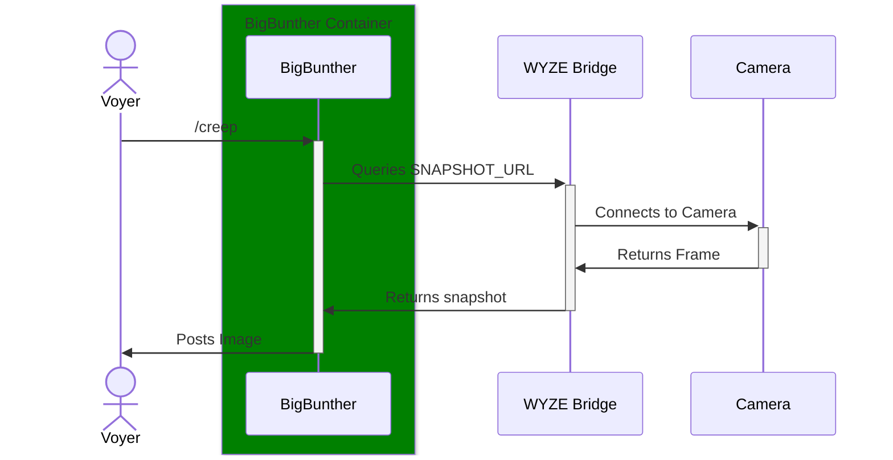
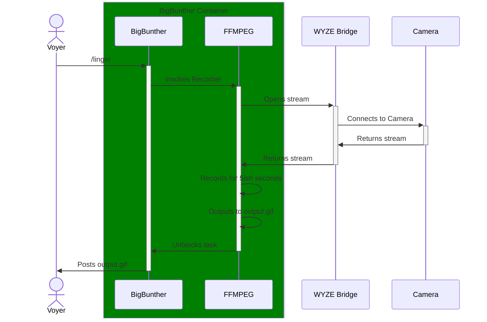
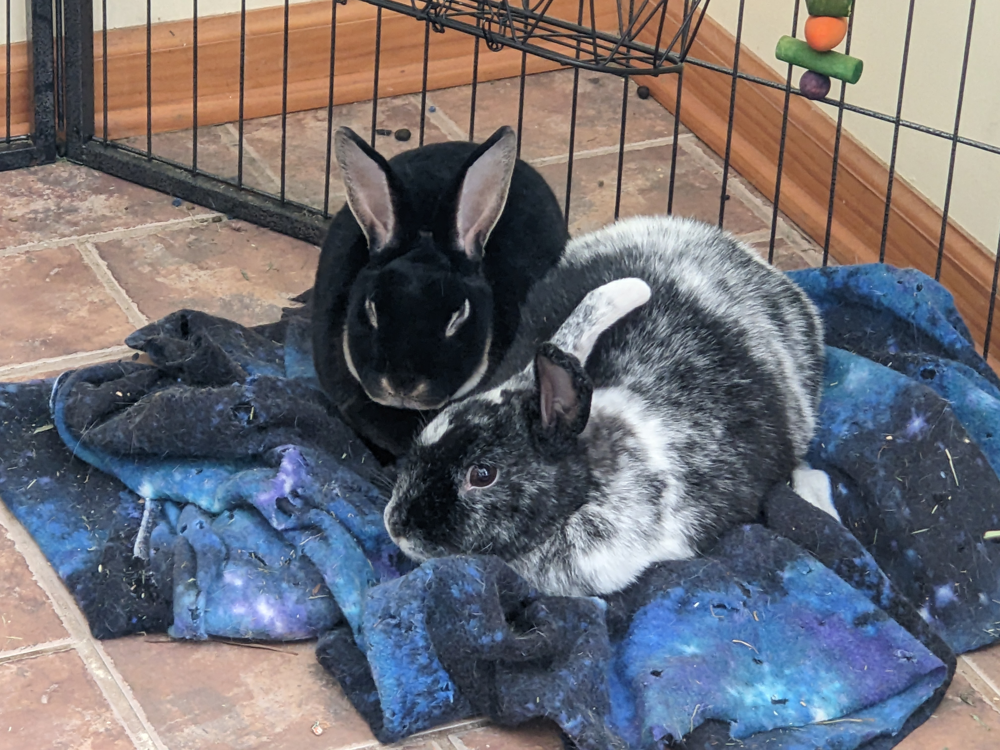

# Big Bunther

A small Discord bot that can post images/gifs from a camera when a user requests them.

## How does it work?

Big Bunther sits in your server and waits for one of two commands currently, `/creep` and `/linger`. These commands call functions within the code to pull frames from cameras and post them as a response.

Here's how the process flow looks like for someone using WYZE Cameras:

### /creep


### /linger


# Setup

Big Bunther is designed to be run through docker primarily, but running it in other environments is totally possible.

## Docker

This repo automatically builds branches and [hosts them in GitHub](https://github.com/PrivateButts/BigBunther/pkgs/container/bigbunther). Labels match each branch, but for the most part you'll want `ghcr.io/privatebutts/bigbunther:main`. If you'd like to use docker compose, [refer to this docker compose file in the repo](docker-compose.yaml) to get started. If you'd prefer to start it from cli, here's a template command to get started:

```shell
docker run -d --restart unless-stopped --name bigbunther \
  -e SNAPSHOT_URL=example.com/snapshot.jpg \
  -e SNAPSHOT_FILENAME=creep.jpg \
  -e STREAM_URL=rtsp://example.com/stream \
  -e GIF_LENGTH=5 \
  -e GIF_FPS=15 \
  -e DISCORD_TOKEN=YOUR_DISCORD_TOKEN \
  ghcr.io/privatebutts/bigbunther:main
```

Refer to the [configuration reference table](#configuration-reference) for how to set the ENVs

## Manual

If you don't want to use Docker for some reason, the requirements to install and run the application directly aren't onerous. You'll need git, Python 3.12 and [pdm](https://github.com/pdm-project/pdm) installed. For convenience, a [justfile](https://github.com/casey/just) has been provided with helper scripts (`just setup`). If you don't have just, you can follow these steps:

1. Clone the repo to where you want to install the application:

    `git clone https://github.com/PrivateButts/BigBunther.git`

2. cd into the application directory

    `cd BigBunther`

3. Setup your virtual environment

    `pdm sync --prod`

4. Create and edit `./src/bigbunther/.env` using the provided .env.example as a starting point. Use the [configuration reference table](#configuration-reference) below to guide your tweaking.

5. cd into the application folder

    `cd src/bigbunther/`

6. Start the application

    `pdm run main.py`


## Configuration Reference
Configuration is pulled in through environmental variables. If you'd rather use a file, place a `.env` file in the `./src/bigbunther/` folder (the same as `.env.example`). Uses `PARAMETER=VALUE` format.

Parameter | Type | Required | Default | Description
----------|------|----------|---------|------------
SNAPSHOT_URL | String | For `/creep` | None | Sets the url Big Bunther will scrape when `/creep` is called. Should return an image that Discord can handle
SNAPSHOT_FILENAME | String | No | `creep.jpg` | The filename that will be sent to Discord. Extension should match what you're scraping from the camera.
STREAM_URL | String | For `/linger` | None | Sets the url Big Bunther will send to FFMPEG for recording. Should be in the same format as an FFMPEG input.
GIF_LENGTH | Integer | No | 5 | Sets how long FFMPEG will record from the stream
GIF_FPS | Integer | No | 15 | Sets the framerate of the gif output
DISCORD_TOKEN | String | Yes | None | A bot token from the [Discord Developer Portal](https://discord.com/developers/applications). [Refer to these instructions on how to generate one](https://discordpy.readthedocs.io/en/stable/discord.html#discord-intro).

# Why does this exist?



Someone has to keep an eye on these little dorks.